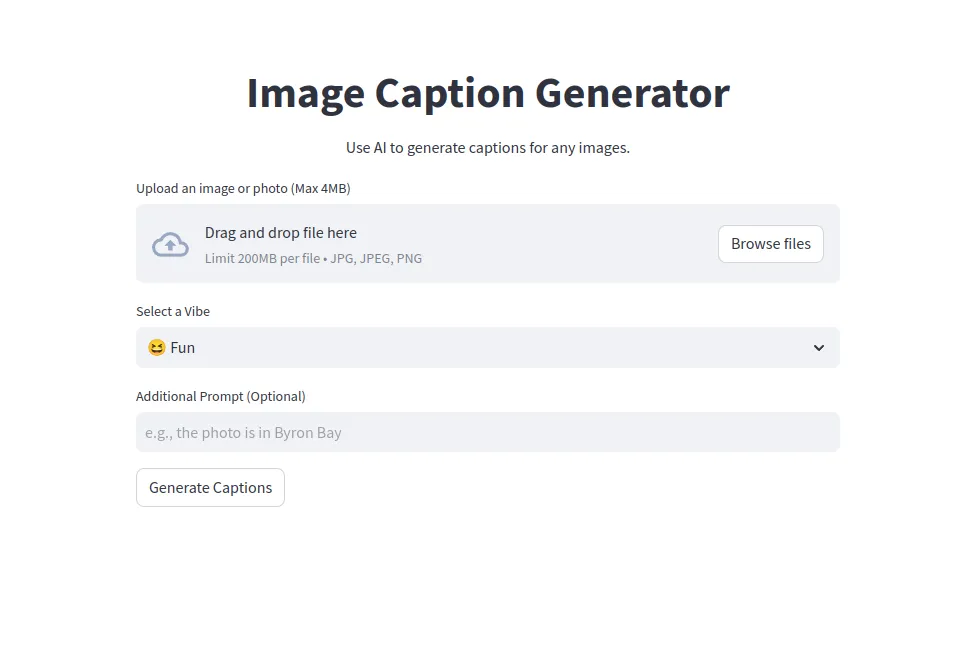

# OpenAI Image Caption Generator with Streamlit

This repository contains a simple web application built using Streamlit that leverages OpenAI's GPT-4 Vision API to generate captions for uploaded images. Users can upload an image, select a desired vibe (e.g., fun, serious, cute), and optionally provide additional context. The app will then generate three unique captions tailored to the selected vibe and context.

## Features

- **Image Upload**: Users can upload images in various formats (JPG, JPEG, PNG) up to a maximum size of 4MB.
- **Vibe Selection**: Users can choose from a list of predefined vibes (e.g., fun, joke, serious, cute, controversial) to influence the tone and mood of the generated captions.
- **Additional Prompt (Optional)**: Users can provide an additional prompt or context to further guide the caption generation process.
- **Caption Generation**: The app leverages OpenAI's GPT-4 Vision API to analyze the uploaded image and generate three unique and relevant captions based on the selected vibe and any additional context provided.
- **Caption Display**: The generated captions are displayed on the app's interface, allowing users to choose the most suitable caption for their image.

## Prerequisites

- Python 3.x
- Streamlit
- OpenAI API key

## Installation

1. Clone the repository:
git clone git@github.com:manjurulhoque/openai-streamlit-caption-generator.git
2. Install the required dependencies:
pip install -r requirements.txt
3. Set up your OpenAI API key as a Streamlit secret:
mkdir -p ~/.streamlit/
echo "[general]
secret_key = 'your_openai_api_key_here'" > ~/.streamlit/secrets.toml
## Usage

1. Run the Streamlit app:
streamlit run app.py
2. The app will open in your default web browser.
3. Upload an image, select a vibe, and optionally provide additional context.
4. Click the "Generate Captions" button to generate captions for your image.
5. The generated captions will be displayed on the app's interface.

## Contributing

Contributions are welcome! If you find any issues or have suggestions for improvements, please open an issue or submit a pull request.
